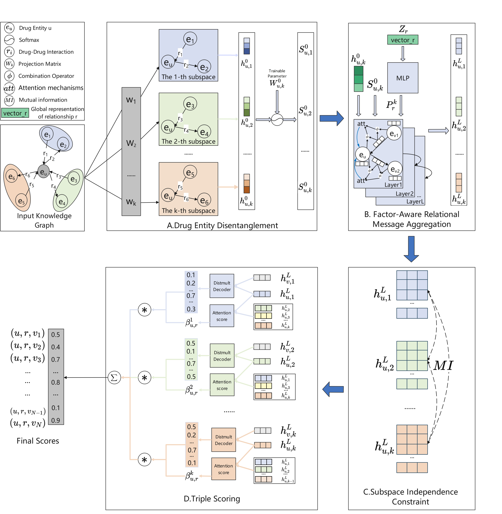

## DisenKGE-DDI: A Knowledge Graph Embedding Framework Based on Disentangled Graph Attention Networks for Drug-Drug Interaction Prediction

DisenKGE-DDI is a novel model designed for drug-drug interaction (DDI) prediction, leveraging a disentangled graph attention mechanism. By integrating both micro-disentanglement and macro-disentanglement mechanisms, the model effectively captures intricate interaction patterns within multi-relational knowledge graphs.

<h2 align="center">
  Overview of DisenKGE-DDI
  
</h2>
<p align="left"style="font-size: 10px">Overview of the DisenKGE-DDI framework. A. Drug Entity Disentanglement Module: The initial features of each drug entity u are projected into distinct latent spaces, which encode various semantics of the drug entity. B. Factor-Aware Relational Message Aggregation Module: We have developed a factor-aware relational message aggregation method. First, a relation-guided routing mechanism selects a relevant subset of neighbors associated with the current semantic aspect. Then, an attention mechanism is employed to learn the embedding representation of each latent factor based on the correlation between relationships and latent factors. C. Subspace Independence Constraint Module: Mutual information regularization is introduced to ensure the independence of components by optimizing the mutual information between them. D. Triple Scoring Module: The learned disentangled representations are passed into the decoder, where a knowledge graph embedding model DistMult is employed to calculate the scores of candidate triples for each semantic component. The scores from all components are subsequently aggregated through an attention mechanism to generate the final prediction score.</p>


###  Source codes:

+ data_loader.py: Loads and preprocesses datasets, prepares training and evaluation samples.
+ DisenLayer.py: Implements the disentangled graph layer, projecting node features into multiple latent semantic spaces.
+ helper.py: Contains utility functions for logging, evaluation metrics, random seed control, etc.
+ model.py: Defines the complete model architecture including encoders, attention layers, and disentanglement modules.
+ run.py: The main entry point script for training, validation, and testing.


# Step-by-step running:

## Requirements

```sh
torch==1.8.0
ordered_set==4.0.2
numpy==1.21.2
torch-geometric==1.7.2                 
torch-scatter==2.0.8               
torch-sparse==0.6.12
scipy==1.7.1
```

## Configure the environment：

```sh
conda create -n disenkge_ddi python=3.8
pip3 install torch==1.8.0+cu111 torchvision==0.9.0+cu111 torchaudio==0.8.0
pip install torch-scatter==2.0.8
pip install torch-sparse==0.6.12
pip install torch-geometric==1.7.2
conda install dglteam::dgl-cuda11.1
conda install libgcc
pip3 install -r requirements.txt
pip install scikit-learn
```


## Dataset:

+ We use DeepDDI dataset for drug-drug interaction prediction.
+ DeepDDI is included in the `data` directory.

## Training model:

+ Install all the requirements from `requirements.txt.`
+ Commands for reproducing the reported results on drug-drug interaction prediction:

```sh
python run.py 
```

### Contacts

If you have any questions or comments, please feel free to email Ge Zhang (zhangge@henu.edu.cn).
